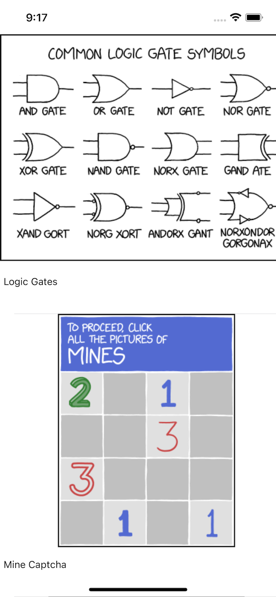

# AsyncXKCD
An Xcode12 project for iOS that asynchronously downloads and displays xkcd comics images and captions. It fills a UITableView as needed to keep the UI responsive while dowloads happen on a different thread. This project was created in Wright State University CS-3170 "Mobile Apps" on Nov. 5, 2021 as a demonstration of the following Cocoa Touch features:

- URLSession
- URLSession data tasks
- Asynchronous UITableView content updating
- JSONDecoder
- DispatchQueue
- A design pattern for exclusively updating shared data on the main thread to avoid data corruption
- NotificationCenter and Notification to decouple posters and observers a.k.a. publishers and subscribers

This is an almost minimal example. It was created in one class session including time spent discussing the myriad ways shared dat may become corrupted and the dangers of rolling your own concurrency design using mutex loks or similer. The TL;DR is "Use the frameworks that do those things for you".

